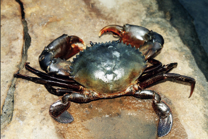

```{r setup, include=FALSE}
knitr::opts_chunk$set(echo = TRUE)
```

## Scylla serrata map

This repository contains the code and output of a GIS workflow used to make an interactive map of _Scylla serrata_ occurrences in South Africa.

_Scylla serrata_ (known commonly as the Mud crab) is a large carnivorous crab that inhabits estuarine ecosystems. It's found in tropical and subtropical environments world wide. In South Africa from the south eastern coast upwards along the east coast.  


```{r Scylla serrata, echo= FALSE, out.width="60%", include=TRUE, fig.align='center', fig.cap='Scylla serrata'}



```

I have created an interactive map of research grade Mud crab occurrences from iNaturalist. Each occurrence point can be clicked on and the link to its iNaturalist observation, the user name of the observer and the date observed will pop up. 


The code for my map can be found in my code folder. The markdown document Scylla-map contains my clean code and the raw code script is called Scylla-map-raw. 